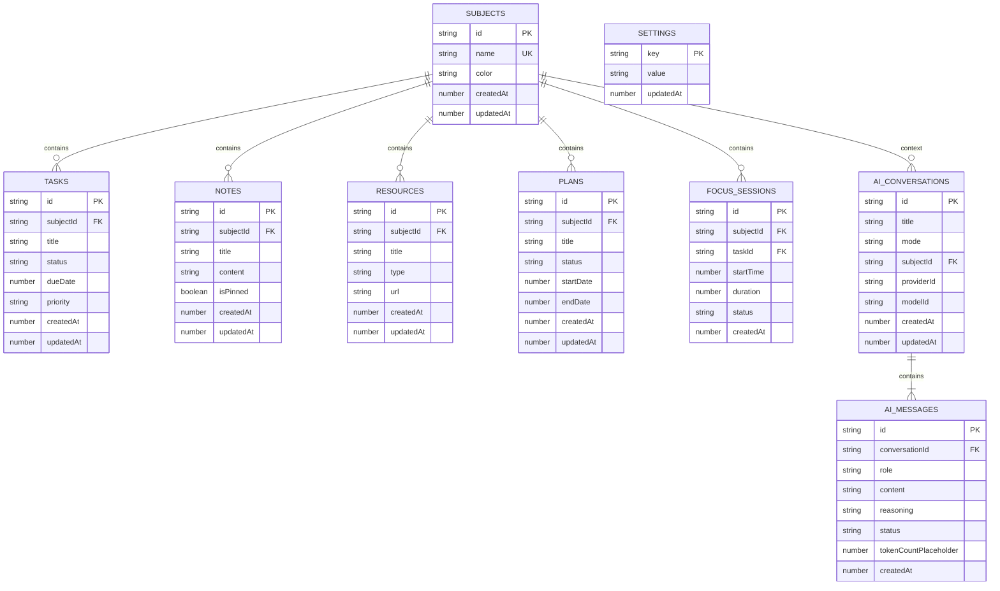

# Phase 1 Implementation Plan — Data Foundation, Schema Migration & Conversation Persistence Redesign

## 1. Executive Summary

### Primary Objective
> Preserve all verified Phase 0 behavior while safely upgrading Aether’s data model, migration system, conversation persistence, and backup compatibility.

### Architectural Purpose & Scope
Phase 1 establishes a robust, type-safe, versioned persistence layer for the Aether Study Productivity Workspace across Web and Windows Desktop environments. By introducing Dexie Schema Version 4, a normalized conversation/message data model, transactional migration pipelines, and versioned workspace backup export/import handlers, Phase 1 resolves structural persistence limitations without altering UI presentation or breaking verified Phase 0 AI transport channels.

### Invariants — What Remains Unchanged
- **Web & Desktop Parity**: Unified data layer supporting browser IndexedDB and Electron desktop shell.
- **IPC & AI Networking Isolation**: Remote provider calls remain inside Electron Main; Renderer accesses AI via secure preload bridge.
- **Credential Storage Security**: Secrets remain in OS Vault via `safeStorage` (Electron) or local server store (Express). No API keys in backups or IndexedDB.
- **Zero UI Redesign**: Preserves current layout, design tokens, and CSS.

### Explicit Phase 1 Exclusions
- UI redesign or layout modifications.
- New LLM provider integrations or provider consolidation.
- Vector search, embeddings, or automated resource indexing.
- Citations presentation UI or user-facing source footnotes.
- Token billing, pricing tier, or monetary cost tracking.
- Proposed AI actions or automated workspace mutations.

---

## 2. Current-State Persistence Inventory

Based on authoritative code inspection of `src/db/index.ts`, `src/db/schema.ts`, `src/db/migration.ts`, `server/services/credentialStore.ts`, and `electron/services/credentials/credential-service.ts`:

### Active Database & Version
- **Database Name**: `AetherDatabase`
- **Current Schema Version**: Version 3
- **ORM / Driver**: Dexie.js (`IndexedDB`)

### Existing Schema Version 3 Tables & Indexes
1. `subjects`: `++id, &name, createdAt, updatedAt`
2. `tasks`: `++id, subjectId, title, status, dueDate, priority, createdAt, updatedAt`
3. `notes`: `++id, subjectId, title, isPinned, createdAt, updatedAt`
4. `resources`: `++id, subjectId, title, type, url, createdAt, updatedAt`
5. `plans`: `++id, subjectId, title, status, startDate, endDate, createdAt, updatedAt`
6. `focusSessions`: `++id, subjectId, taskId, startTime, duration, status, createdAt`
7. `aiConversations`: `++id, title, mode, subjectId, createdAt, updatedAt`

### Current Limitations Identified
- **Flat AI Conversations**: `aiConversations` currently embeds messages inside a JSON array property (`messages: Array<{ role, content, timestamp }>`) rather than a normalized relational `aiMessages` table.
- **Lack of Streaming Teardown Status**: Interrupted or failed AI streams leave unflagged transient records in memory/storage.
- **Unversioned Workspace Backups**: JSON backup exports contain entity dumps without explicit schema-version envelope headers.

---

## 3. Phase 1 Target Schema (Dexie Version 4)

The Phase 1 target data model introduces normalized `aiMessages` and application `settings` while extending core entities with audit timestamps and relational integrity rules.



### Table Definitions & Primary Key Strategy
All new and migrated entities utilize string UUIDs (`&id`) for robust multi-platform sync and deterministic backup deduplication.

1. **`subjects`**: `&id, &name, createdAt, updatedAt`
2. **`tasks`**: `&id, subjectId, status, dueDate, priority, createdAt, updatedAt`
3. **`notes`**: `&id, subjectId, title, isPinned, createdAt, updatedAt`
4. **`resources`**: `&id, subjectId, title, type, createdAt, updatedAt`
5. **`plans`**: `&id, subjectId, status, startDate, endDate, createdAt, updatedAt`
6. **`focusSessions`**: `&id, subjectId, taskId, startTime, status, createdAt`
7. **`aiConversations`**: `&id, subjectId, mode, providerId, modelId, createdAt, updatedAt`
8. **`aiMessages`**: `&id, conversationId, role, status, createdAt`
9. **`settings`**: `&key, updatedAt`

---

## 4. Conversation & Message Persistence Redesign

### Entity Definitions

#### `AIConversation`
- `id`: string (UUID, Primary Key)
- `title`: string (Human-readable conversation topic)
- `mode`: string (`tutor` | `study_planner` | `quiz_gen` | `summarizer`)
- `subjectId`: string | null (Optional link to Subject)
- `providerId`: string (ID of provider used, e.g., `openai`, `nvidia_nim`)
- `modelId`: string (Model identifier, e.g., `gpt-4o`, `deepseek-v3`)
- `createdAt`: number (Unix timestamp ms)
- `updatedAt`: number (Unix timestamp ms)

#### `AIMessage`
- `id`: string (UUID, Primary Key)
- `conversationId`: string (Foreign Key -> `aiConversations.id`)
- `role`: string (`user` | `assistant` | `system`)
- `content`: string (Markdown content text)
- `reasoning`: string | null (Optional reasoning fragment for reasoning models)
- `status`: string (`completed` | `streaming` | `interrupted` | `failed`)
- `groundingResourceIds`: string[] (Array of referenced resource IDs)
- `citationsPlaceholder`: Array<{ sourceId: string; span: [number, number] }> | null (Placeholder for future citations)
- `usagePlaceholder`: { promptTokens?: number; completionTokens?: number } | null (Placeholder for token count)
- `createdAt`: number (Unix timestamp ms)

### Lifecycle Rules & State Transitions
- **New Conversation**: Created upon first user query in a session.
- **Message Append**: User message inserted immediately with `status: 'completed'`. Assistant message inserted with `status: 'streaming'`.
- **Stream Complete**: Assistant message updated to `status: 'completed'` with final `content` and `reasoning`.
- **Stream Interrupted / App Restart**: On startup, any message with `status: 'streaming'` is automatically updated to `status: 'interrupted'`.

---

## 5. Dexie Version Upgrade & Migration Strategy

### Proposed Upgrade: Version 3 -> Version 4

```ts
db.version(4).stores({
  subjects: '&id, &name, createdAt, updatedAt',
  tasks: '&id, subjectId, status, dueDate, priority, createdAt, updatedAt',
  notes: '&id, subjectId, title, isPinned, createdAt, updatedAt',
  resources: '&id, subjectId, title, type, createdAt, updatedAt',
  plans: '&id, subjectId, status, startDate, endDate, createdAt, updatedAt',
  focusSessions: '&id, subjectId, taskId, startTime, status, createdAt',
  aiConversations: '&id, subjectId, mode, providerId, modelId, createdAt, updatedAt',
  aiMessages: '&id, conversationId, role, status, createdAt',
  settings: '&key, updatedAt',
}).upgrade(async (tx) => {
  // 1. Migrate auto-increment integer IDs to UUID strings where necessary
  // 2. Extract embedded aiConversations.messages array into normalized aiMessages table
  // 3. Mark any unclosed streaming messages as 'interrupted'
  // 4. Ensure referential integrity across subjectId references
});
```

### Migration Safeguards
- **Idempotency**: Upgrade script runs inside a single Dexie transaction block (`tx`). If an error occurs, Dexie rolls back all changes automatically.
- **Malformed Record Handling**: Legacy messages missing `role` or `content` default to `role: 'user'` and empty string content without throwing uncaught exceptions.
- **Orphan Teardown**: `aiMessages` referencing non-existent `aiConversations` are pruned during migration.

---

## 6. Phase 0 Migration Fixtures & Test Suite

To ensure 100% data preservation during migration, Phase 1 creates synthetic test fixtures representing all supported workspace variations:

1. **`empty-db-v3.json`**: Fresh database with 0 records.
2. **`standard-workspace-v3.json`**: Representative user workspace with 5 subjects, 20 tasks, 10 notes, 3 plans, and 4 AI conversations with embedded message arrays.
3. **`malformed-legacy-v3.json`**: Workspace containing legacy records with missing `updatedAt` timestamps, stringified dates, and orphaned tasks.
4. **`large-workspace-v3.json`**: Stresstest workspace with 1,000 tasks, 500 notes, and 50 AI conversations (1,500 messages).

---

## 7. Workspace Backup & Restore Compatibility

### Backup Format Specification (Version 2 Envelope)
```json
{
  "version": 2,
  "exportedAt": 1774396800000,
  "appVersion": "1.0.0",
  "data": {
    "subjects": [],
    "tasks": [],
    "notes": [],
    "resources": [],
    "plans": [],
    "focusSessions": [],
    "aiConversations": [],
    "aiMessages": [],
    "settings": []
  }
}
```

### Backward Compatibility (Version 1 Phase 0 Backups)
- Import handler auto-detects unversioned legacy array dumps or Version 1 JSON files.
- Version 1 backups pass through an in-memory normalization pipeline before insertion, converting embedded `aiConversations.messages` into normalized `aiMessages` records.

### Security Invariant Verification
- Import/Export scripts strip any sensitive key properties (`apiKey`, `encryptedKey`, `token`, `password`) before writing JSON files.

---

## 8. Detailed Work Package Breakdown

### Work Package 1 — Data Layer Inventory & Types Definition
- **Scope**: Define TypeScript interfaces for Version 4 entities (`AIConversation`, `AIMessage`, `WorkspaceBackupV2`).
- **Files Affected**: `src/types/database.ts`, `src/db/schema.ts`
- **Acceptance Criteria**: Types export cleanly; 0 build errors.

### Work Package 2 — Migration Test Harness & Fixtures
- **Scope**: Build synthetic Version 3 fixtures and migration test utilities.
- **Files Affected**: `src/db/__tests__/fixtures/v3Workspace.ts`, `src/db/__tests__/migrationV4.test.ts`
- **Acceptance Criteria**: Test harness can load, seed, and reset IndexedDB test environments.

### Work Package 3 — Dexie Version 4 Schema & Upgrade Transaction
- **Scope**: Implement `db.version(4)` upgrade callback in `src/db/index.ts`.
- **Files Affected**: `src/db/index.ts`, `src/db/migration.ts`
- **Acceptance Criteria**: Successfully migrates V3 IndexedDB schemas to V4 without data loss.

### Work Package 4 — Normalized Conversation & Message Services
- **Scope**: Create `conversationService.ts` to manage normalized CRUD operations for `aiConversations` and `aiMessages`.
- **Files Affected**: `src/services/ai/conversationService.ts`
- **Acceptance Criteria**: Interrupted streams resume or mark as interrupted safely.

### Work Package 5 — Backup Export & Import Envelope V2
- **Scope**: Update `src/services/backupService.ts` to export Version 2 format and import Version 1 & 2 formats.
- **Files Affected**: `src/services/backupService.ts`
- **Acceptance Criteria**: Import of legacy V1 backup creates valid V4 IndexedDB tables.

### Work Package 6 — Performance & Stresstest Validation
- **Scope**: Run migration and export benchmark against `large-workspace-v3.json`.
- **Files Affected**: `src/db/__tests__/performance.test.ts`
- **Acceptance Criteria**: Migration completes under 1,500ms for 2,000 entities.

### Work Package 7 — Comprehensive Regression & Build Validation
- **Scope**: Run full Vitest suite and production Web/Electron builds.
- **Files Affected**: Entire test suite.
- **Acceptance Criteria**: 100% test pass rate, 0 build errors.

---

## 9. Comprehensive Test Matrix

| Test Suite | File Path | Focus Area | Expected Outcome |
|---|---|---|---|
| Migration V4 Unit | `src/db/__tests__/migrationV4.test.ts` | V3 -> V4 schema upgrade | 100% data preservation |
| Legacy Import | `src/services/__tests__/backupV1Import.test.ts` | Phase 0 V1 JSON import | Normalized V4 records created |
| Conversation Service | `src/services/ai/__tests__/conversationService.test.ts` | Message append & stream interruption | `status: 'interrupted'` handled cleanly |
| Security Verification | `src/services/__tests__/backupSecurity.test.ts` | Credential stripping in backups | 0 secret keys present in exported JSON |
| Performance Benchmark | `src/db/__tests__/performance.test.ts` | 2,000 entity migration speed | < 1,500ms execution time |
| Phase 0 Regressions | `src/services/ai/__tests__/*.test.ts` | Phase 0 AI transport tests | All 31 test files pass |

---

## 10. Manual Verification Protocol

1. **Existing User Upgrade**: Open existing workspace -> verify all tasks, notes, subjects, and AI chat history persist.
2. **New User Initialization**: Launch fresh browser/desktop session -> verify clean DB initialization without console errors.
3. **Stream Interruption & Recovery**: Start AI chat generation -> close window mid-stream -> reopen -> verify message displays `[Interrupted]`.
4. **V1 Backup Import**: Export backup in Phase 0 -> import into Phase 1 -> verify full data restoration.
5. **Desktop Teardown & Restart**: Close packaged Electron application -> relaunch -> confirm Dexie IndexedDB state remains intact.

---

## 11. Performance Safeguards
- **IndexedDB Batching**: Bulk writes to `aiMessages` use `db.aiMessages.bulkAdd()` or `bulkPut()` in chunks of 500 items.
- **IPC Payload Capping**: Renderer-to-Main IPC message payloads capped at 2MB per payload to prevent main thread lag.
- **JSON Stream Parsing**: Large backup imports use chunked object processing.

---

## 12. Security and Privacy Invariants
- **Credential Encryption**: API keys remain locked inside Windows Vault (`safeStorage`) or Express local store.
- **Secret Redaction**: Error logs pass through `redactSecretsInString` before display or output.
- **Backup Hygiene**: Exported JSON files are checked for `sk-`, `nvapi-`, and `Bearer` string patterns before write completion.

---

## 13. Definition of Done
Phase 1 will be declared complete when:
1. All Phase 0 regression tests pass with 0 failures.
2. Dexie Version 4 migration executes cleanly across all 4 synthetic workspace fixtures.
3. V1 legacy workspace backups import seamlessly into V4 schema.
4. AI conversation history survives stream interruptions and application restarts.
5. Production `npm run build` and `npm run build:electron` execute with 0 TypeScript/compilation errors.
6. A final independent Phase 1 verification report is produced and committed.
