# Phase 1 Implementation Plan — Persistence Architecture, Backup Engine & Data Hardening

## 1. Executive Summary

### Architectural Purpose & Scope
Phase 1 establishes a type-safe, versioned persistence architecture for Aether across Web and Windows Desktop environments. Grounded directly in `src/db/database.ts`, `src/types/index.ts`, `src/api/*`, `src/store/useAppStore.ts`, and `src/views/SettingsView.tsx`, this document provides an authoritative blueprint for data inventory, AI persistence ownership, backup envelope design, transactional restore semantics, and real-database test validation.

### Core Architectural Invariants
- **Database Identity**: `AetherPhase1DB` running on **Dexie Version 3** with **14 normalized tables**.
- **No Dexie Version 4 Schema Upgrade**: No schema migration is required. Dexie Version 3 already defines all 14 necessary tables.
- **AI Conversation Storage Model**: Preserves the flat `AIConversation` interaction model (**Strategy A**), eliminating schema migration risks.
- **Single AI Writer**: Designates `aiOrchestrator.send()` in `src/services/ai/orchestrator.ts` as the sole authoritative writer for completed AI interaction records, eliminating duplicate writes.
- **Backup & Restore Strategy**:
  - **Version 2 Backup**: Complete 14-table **Replace Restore Only** guarded by a mandatory pre-restore downloadable safety backup and a 14-table Dexie transaction.
  - **Legacy Export**: Unversioned 8-table **Partial Merge Import Only** for legacy Phase 0 exports.
- **Compatibility Statement**: Preserving the flat AI interaction model minimises schema-migration risk and retains the existing record representation. Backward compatibility remains an implementation objective that must be demonstrated through real IndexedDB integration tests and the complete Phase 0 regression suite.

---

## 2. Verified Repository Baseline

- **Repository**: `AhmedTarekPortfolio/Aether`
- **Active Branch**: `main`
- **Current Commit**: `d85e431d41d18d38ec196be7c703ad7dc898e072` (`docs: rewrite Phase 1 plan from actual persistence architecture`)
- **Divergence from `origin/main`**: Local `main` is 1 commit ahead (`0 left, 1 right`)
- **Annotated Tag**: `phase-0-baseline` (peeling to commit `4bac10a72bf20f569eca5d4fb599f7ba855a16cd`)
- **Working Tree**: Clean (`nothing to commit, working tree clean`)
- **Verification Gates**: `npm test` (31 test files, 168 tests passed), `npm run build` (0 errors), `npm run build:electron` (0 errors).

---

## 3. Authoritative Reader and Writer Inventory (14 Tables)

### 1. `users`
- **Primary Key**: `id` (String, e.g. `'default_user'`)
- **Indexes**: `id, &email`
- **Seed Path**: `seedInitialDataIfEmpty()` in `src/db/database.ts` (lines 213–220)
- **Read Paths**: `db.users.get('default_user')` in `useAppStore.ts` (line 89), `db.users.toArray()` in `SettingsView.tsx` (line 44)
- **Writer Paths**: `api.updateUser()` in `src/api/userApi.ts`
- **Wrapper API**: `src/api/userApi.ts` (`getUserById`, `updateUser`)
- **Store Access**: `useAppStore.ts` synthesizes `userProfile` from `users` + `settings`

### 2. `settings`
- **Primary Key**: `id` (String, e.g. `'default_settings'`)
- **Indexes**: `id, &userId`
- **Seed Path**: `seedInitialDataIfEmpty()` in `src/db/database.ts` (lines 221–230)
- **Read Paths**: `db.settings.get('default_settings')` in `useAppStore.ts` (line 90), `db.settings.toArray()` in `SettingsView.tsx` (line 45)
- **Writer Paths**: `api.updateSettings()` in `src/api/settingsApi.ts`
- **Wrapper API**: `src/api/settingsApi.ts` (`getSettings`, `updateSettings`)
- **Store Access**: `useAppStore.ts` (`updateProfile`)

### 3. `subjects`
- **Primary Key**: `id` (String, e.g. `'sub_cs301'`)
- **Indexes**: `id, userId, name, confidenceRating`
- **Seed Path**: `seedInitialDataIfEmpty()` in `src/db/database.ts` (lines 237–283)
- **Read Paths**: `useLiveQuery(() => db.subjects.toArray())` in `useAppStore.ts` (line 78), `db.subjects.toArray()` in `SettingsView.tsx` (line 46)
- **Writer Paths**: `api.addSubject()`, `api.updateSubject()`, `api.deleteSubject()` in `src/api/subjectApi.ts`
- **Wrapper API**: `src/api/subjectApi.ts` (`getSubjects`, `addSubject`, `updateSubject`, `deleteSubject`)
- **Store Access**: `useAppStore.ts` (`addSubject`, `updateSubject`, `deleteSubject`)

### 4. `topics`
- **Primary Key**: `id` (String, e.g. `'top_dp'`)
- **Indexes**: `id, subjectId, title, masteryLevel`
- **Seed Path**: `seedInitialDataIfEmpty()` in `src/db/database.ts` (lines 285–292)
- **Read Paths**: `useLiveQuery(() => db.topics.toArray())` in `useAppStore.ts` (line 79), `db.topics.toArray()` in `SettingsView.tsx` (line 47)
- **Writer Paths**: `api.addTopic()`, `api.updateTopic()`, `api.deleteTopic()` in `src/api/topicApi.ts`
- **Wrapper API**: `src/api/topicApi.ts` (`getTopicsBySubject`, `addTopic`, `updateTopic`, `deleteTopic`)

### 5. `tasks`
- **Primary Key**: `id` (String, e.g. `'task_1'`)
- **Indexes**: `id, userId, subjectId, priority, status, dueDate`
- **Seed Path**: `seedInitialDataIfEmpty()` in `src/db/database.ts` (lines 294–337)
- **Read Paths**: `useLiveQuery(() => db.tasks.toArray())` in `useAppStore.ts` (line 80), `db.tasks.toArray()` in `SettingsView.tsx` (line 48)
- **Writer Paths**: `api.addTask()`, `api.updateTask()`, `api.deleteTask()` in `src/api/taskApi.ts`
- **Wrapper API**: `src/api/taskApi.ts` (`getTasks`, `getTaskById`, `addTask`, `updateTask`, `deleteTask`)

### 6. `notes`
- **Primary Key**: `id` (String, e.g. `'note_dp'`)
- **Indexes**: `id, userId, subjectId, topicId, title, updatedAt`
- **Seed Path**: `seedInitialDataIfEmpty()` in `src/db/database.ts` (lines 339–391)
- **Read Paths**: `useLiveQuery(() => db.notes.orderBy('updatedAt').reverse().toArray())` in `useAppStore.ts` (line 81), `db.notes.toArray()` in `SettingsView.tsx` (line 49)
- **Writer Paths**: `api.addNote()`, `api.updateNote()`, `api.deleteNote()` in `src/api/noteApi.ts`
- **Wrapper API**: `src/api/noteApi.ts` (`getNotes`, `addNote`, `updateNote`, `deleteNote`)

### 7. `flashcards`
- **Primary Key**: `id` (String)
- **Indexes**: `id, userId, subjectId, topicId, nextReviewDate`
- **Seed Path**: Migration V2/V3 in `src/db/database.ts`
- **Read Paths**: `useLiveQuery(() => db.flashcards.toArray())` in `useAppStore.ts` (line 82), `db.flashcards.toArray()` in `SettingsView.tsx` (line 50)
- **Writer Paths**: `api.addFlashcard()`, `api.updateFlashcard()`, `api.deleteFlashcard()` in `src/api/flashcardApi.ts`
- **Wrapper API**: `src/api/flashcardApi.ts` (`getFlashcardsBySubject`, `addFlashcard`, `updateFlashcard`, `deleteFlashcard`)

### 8. `sessions`
- **Primary Key**: `id` (String, e.g. `'focus_1'`)
- **Indexes**: `id, userId, subjectId, taskId, completedAt`
- **Seed Path**: `seedInitialDataIfEmpty()` in `src/db/database.ts` (lines 393–420)
- **Read Paths**: `useLiveQuery(() => db.sessions.toArray())` in `useAppStore.ts` (line 83), `db.sessions.toArray()` in `SettingsView.tsx` (line 51)
- **Writer Paths**: `api.addSession()` in `src/api/sessionApi.ts`
- **Wrapper API**: `src/api/sessionApi.ts` (`getSessions`, `addSession`)

### 9. `goals`
- **Primary Key**: `id` (String)
- **Indexes**: `id, userId, subjectId, status`
- **Seed Path**: Migration V3 in `src/db/database.ts`
- **Read Paths**: `api.getGoals()` in `src/api/goalApi.ts`
- **Writer Paths**: `api.addGoal()`, `api.updateGoal()` in `src/api/goalApi.ts`
- **Wrapper API**: `src/api/goalApi.ts` (`getGoals`, `addGoal`, `updateGoal`)

### 10. `ai_conversations`
- **Primary Key**: `id` (String, e.g. `'ai_1'`, `'req_123'`)
- **Indexes**: `id, userId, subjectId, mode, timestamp`
- **Seed Path**: `seedInitialDataIfEmpty()` in `src/db/database.ts` (lines 422–433)
- **Read Paths**: `useLiveQuery(() => db.ai_conversations.orderBy('timestamp').toArray())` in `useAppStore.ts` (line 84)
- **Writer Paths**: `aiOrchestrator.send()` in `src/services/ai/orchestrator.ts` (line 217), `AIAssistantView.tsx` (line 221 -> duplicate writer to be removed in WP-07)
- **Wrapper API**: `src/api/aiConversationApi.ts` (`getAIConversations`, `addAIConversation`, `clearAIConversations`)

### 11. `statistics`
- **Primary Key**: `id` (String)
- **Indexes**: `id, userId, [userId+metricKey+periodStart]`
- **Seed Path**: Migration V3 in `src/db/database.ts`
- **Read Paths**: `api.getStatistics()` in `src/api/statisticApi.ts`
- **Writer Paths**: `api.recordStatistic()` in `src/api/statisticApi.ts`
- **Wrapper API**: `src/api/statisticApi.ts` (`getStatistics`, `recordStatistic`)

### 12. `achievement_definitions`
- **Primary Key**: `id` (String, e.g. `'ach_first_task'`)
- **Indexes**: `id, &key`
- **Seed Path**: `seedInitialDataIfEmpty()` in `src/db/database.ts` (lines 460–470)
- **Read Paths**: `api.getAchievementDefinitions()` in `src/api/achievementApi.ts`
- **Writer Paths**: `seedInitialDataIfEmpty()` in `src/db/database.ts`
- **Wrapper API**: `src/api/achievementApi.ts` (`getAchievementDefinitions`)
- **Ownership**: Global application-defined reference data (unscoped).

### 13. `user_achievements`
- **Primary Key**: `id` (String)
- **Indexes**: `id, userId, [userId+achievementId]`
- **Seed Path**: Migration V3 in `src/db/database.ts`
- **Read Paths**: `api.getUserAchievements()` in `src/api/achievementApi.ts`
- **Writer Paths**: `api.updateUserAchievement()` in `src/api/achievementApi.ts`
- **Wrapper API**: `src/api/achievementApi.ts` (`getUserAchievements`, `updateUserAchievement`)

### 14. `notifications`
- **Primary Key**: `id` (String, e.g. `'notif_1'`)
- **Indexes**: `id, userId, type, createdAt`
- **Seed Path**: `seedInitialDataIfEmpty()` in `src/db/database.ts` (lines 435–458)
- **Read Paths**: `useLiveQuery(() => db.notifications.orderBy('createdAt').reverse().toArray())` in `useAppStore.ts` (line 85)
- **Writer Paths**: `api.addNotification()`, `api.markNotificationAsRead()` in `src/api/notificationApi.ts`
- **Wrapper API**: `src/api/notificationApi.ts` (`getNotifications`, `addNotification`, `markNotificationAsRead`, `markAllNotificationsAsRead`)

---

## 4. `userId` and Ownership Invariants Map

| Table Name | `userId` Field Status | Primary Scope / Association | Multi-Tenant Behavior |
|---|---|---|---|
| `users` | `id` is user ID | Global User Profile | `id: 'default_user'` |
| `settings` | Required (`userId`) | User Preferences | Linked to `userId: 'default_user'` |
| `subjects` | Optional (`userId?`) | User Course | Defaults to `'default_user'` |
| `topics` | **Absent** | Subject-Scoped (`subjectId`) | Belongs to parent `Subject` |
| `tasks` | Optional (`userId?`) | User / Subject Task | Defaults to `'default_user'` |
| `notes` | Optional (`userId?`) | User / Subject / Topic Note | Defaults to `'default_user'` |
| `flashcards` | Optional (`userId?`) | Subject / Topic Flashcard | Defaults to `'default_user'` |
| `sessions` | Optional (`userId?`) | User Focus Activity | Defaults to `'default_user'` |
| `goals` | Optional (`userId?`) | User Target Goal | Defaults to `'default_user'` |
| `ai_conversations` | Optional (`userId?`) | User AI History | Defaults to `'default_user'` |
| `statistics` | Optional (`userId?`) | User Metric | Defaults to `'default_user'` |
| `achievement_definitions` | **Absent** | **Global Application Data** | Shared system definitions (unscoped) |
| `user_achievements` | Optional (`userId?`) | User Achievement Progress | Defaults to `'default_user'` |
| `notifications` | Optional (`userId?`) | User System Notification | Defaults to `'default_user'` |

---

## 5. Resolution of Duplicate AI Persistence Writers

### Root Cause Analysis
Current repository inspection reveals two active writer calls for completed AI interactions:
1. **Writer 1 (`aiOrchestrator.send()`)**: In `src/services/ai/orchestrator.ts` line 217, `send()` calls `addAIConversation()` upon completion with `id: prepared.requestId`.
2. **Writer 2 (`AIAssistantView.tsx`)**: In `src/views/AIAssistantView.tsx` line 221, `executePreparedRequest()` calls `onAddAIMessage()` -> `useAppStore.ts` `addAIMessage()` -> `api.addAIConversation()` with `id: ai_${Date.now()}`.

Because Writer 1 uses `prepared.requestId` and Writer 2 uses a generated timestamp ID (`ai_${Date.now()}`), every single AI interaction produces **two distinct persisted records** in `ai_conversations`.

### Authoritative Architecture Resolution (WP-07)
- **Single Authoritative Writer**: `aiOrchestrator.send()` is designated as the **sole writer** for completed AI interaction records in `ai_conversations`.
- **UI Read-Only Conversion**: `AIAssistantView.tsx` line 221 will be updated to remove `onAddAIMessage()`.
- **Reactive UI Synchronization**: The reactive Dexie hook `useLiveQuery(() => db.ai_conversations.orderBy('timestamp').toArray())` in `useAppStore.ts` automatically updates `AIAssistantView` as soon as `aiOrchestrator.send()` completes.
- **Collision-Safe IDs**: All records retain deterministic `prepared.requestId` identifiers.
- **Historical Duplicate Detection**: WP-07 will introduce a non-destructive, reviewable duplicate-detection utility (`findDuplicateAIConversations()`) that identifies records with identical `prompt` and `response` within a 2-second timestamp window. Historical records will **not** be silently deleted during startup.

---

## 6. `generationStatus` Contract Specification

Production `AIConversation` records currently do not write `generationStatus` explicitly. The future status contract is defined as follows:

### Allowed Status Values
1. **`complete`**: Written by `aiOrchestrator.send()` when provider stream or generation finishes normally. Content and optional reasoning are final.
2. **`stopped`**: Written when the user actively cancels generation via `aiOrchestrator.cancel(requestId)`. If partial content was received before cancellation, partial text is persisted with `generationStatus: 'stopped'`. If 0 tokens were received, no empty record is written.
3. **`failed`**: Written when network or provider errors halt generation. The record persists sanitized, redacted error details with `generationStatus: 'failed'`. Raw API keys or response bodies are never stored.

### Legacy Compatibility & Startup Rules
- **Missing Status with Content**: Legacy Version 3 records containing valid prompt/response text but lacking `generationStatus` are interpreted at read-time as `complete`. **They are not modified or rewritten during application startup.**
- **Missing Status without Content**: Legacy records with empty prompt and empty response are ignored during read queries.
- **Unknown Status Values**: Unrecognized status strings are mapped to `'failed'` at read-time with secret-redacted logging.
- **Idempotency**: Repeated application startup or database opening **never rewrites valid existing status values**.

---

## 7. Legacy Unversioned Eight-Table Export Specification

The export function in `SettingsView.tsx` (`handleExportData()`) produces an **unversioned eight-table partial export**:

```json
{
  "users": [...],
  "settings": [...],
  "subjects": [...],
  "topics": [...],
  "tasks": [...],
  "notes": [...],
  "flashcards": [...],
  "sessions": [...],
  "exportedAt": "2026-07-25T00:00:00.000Z"
}
```

### Structural Recognition Rules (Legacy Export)
A JSON file is classified as a legacy export (`legacy-v1`) if and only if:
1. It is valid JSON.
2. It **does not contain** top-level `"version": 2` or `"format": "aether-backup"`.
3. It contains array properties for the 8 legacy exported keys (`users`, `settings`, `subjects`, `topics`, `tasks`, `notes`, `flashcards`, `sessions`).
4. Files are **not required** to contain `"version": 1` because legacy exports were unversioned.

---

## 8. Version 2 Backup Envelope Specification

Complete 14-table backups use the **Version 2 Envelope Format**:

```ts
export interface AetherBackupV2 {
  format: 'aether-backup';
  version: 2;
  schemaVersion: 3;
  applicationVersion: string;
  exportedAt: string; // ISO 8601 string
  recordCounts: {
    users: number;
    settings: number;
    subjects: number;
    topics: number;
    tasks: number;
    notes: number;
    flashcards: number;
    sessions: number;
    goals: number;
    ai_conversations: number;
    statistics: number;
    achievement_definitions: number;
    user_achievements: number;
    notifications: number;
  };
  data: {
    users: User[];
    settings: Settings[];
    subjects: Subject[];
    topics: Topic[];
    tasks: Task[];
    notes: Note[];
    flashcards: Flashcard[];
    sessions: Session[];
    goals: Goal[];
    ai_conversations: AIConversation[];
    statistics: Statistic[];
    achievement_definitions: AchievementDefinition[];
    user_achievements: UserAchievement[];
    notifications: NotificationItem[];
  };
}
```

### Settings & Secret Exclusion Policy
- **Included**: Non-secret IndexedDB settings (`settings.theme`, `settings.soundEnabled`, `settings.aiProvider`, `settings.studyGoalHoursWeekly`).
- **Excluded**: Provider API keys, credentials (`apiKey`, `encryptedKey`, `organizationId`), `localStorage` cached profiles, OS Credential Store (`safeStorage`) data, and Bearer tokens.

---

## 9. Restore Semantics & Conflict Policies

### 1. Version 2 Complete Backup: **Replace Restore Only**
- **Pre-Validation**: Validates envelope JSON format, table array structures, primary key uniqueness, and record count matches before initiating writes.
- **Safety Backup Guard**: Generates and delivers a downloadable V2 pre-restore safety backup (`Aether_PreRestore_SafetyBackup_<ISO>.json`) prior to database clearing. If safety backup delivery fails, restore is aborted.
- **14-Table Dexie Transaction**: Clears all 14 tables and inserts backup datasets inside **a single read-write Dexie transaction**.
- **All-or-Nothing Rollback**: Any error during clear or insert causes Dexie to roll back all 14 tables automatically.

### 2. Legacy Unversioned Export: **Partial Merge Import Only**
- **Non-Destructive**: Imports only the 8 represented tables. **Never clears any table.**
- **6 Absent Tables Intact**: `goals`, `ai_conversations`, `statistics`, `achievement_definitions`, `user_achievements`, and `notifications` remain unmodified.
- **Primary Key Conflict Resolution**:
  - Matching Primary Key (`id`): Incoming record replaces existing database record after validation.
  - New Primary Key: Incoming record is inserted.
  - Duplicate Keys within File: Pre-validation fails before writing.
- **User Warning**: The UI displays an explicit notice that the file is a partial legacy export.

---

## 10. Mandatory Pre-Restore Safety Backup

Prior to executing a Version 2 Replace Restore:
1. `backupService.exportFullBackup()` reads all 14 current tables.
2. Constructs a valid Version 2 JSON safety backup.
3. Triggers browser/electron file delivery (`Aether_PreRestore_SafetyBackup_<ISO>.json`).
4. **Hard Interlock**: If safety backup creation or delivery fails, the restore process is cancelled immediately. No tables are cleared.

---

## 11. Transaction Execution Sequence & Dexie Semantics

```mermaid
sequenceDiagram
    autonumber
    actor User
    participant UI as SettingsView
    participant Service as BackupService
    participant Safety as File Downloader
    participant DB as Dexie (AetherPhase1DB)

    User->>UI: Select Restore Backup File
    UI->>Service: Validate Backup File (V1 or V2)
    Service-->>UI: Validation Summary (Counts, Warnings)
    User->>UI: Confirm Replace Restore
    UI->>Service: Trigger Safety Backup
    Service->>DB: Read 14 Tables
    Service->>Safety: Download Safety Backup File
    Safety-->>UI: Safety Backup Downloaded
    
    rect rgb(40, 20, 60)
        Note over Service,DB: Single 14-Table Read-Write Transaction
        Service->>DB: db.transaction('rw', [14 tables], tx)
        Service->>DB: Clear 14 Tables
        Service->>DB: Bulk Add 14 Table Datasets
        Service->>DB: Verify Record Counts
        DB-->>Service: Commit Transaction
    end

    Service->>DB: Reopen & Re-read Database
    Service-->>UI: Restore Complete (Refresh Live Queries)
```



### Transaction Technical Boundaries
- Explicit 14-Table Scope: `db.transaction('rw', [db.users, db.settings, db.subjects, db.topics, db.tasks, db.notes, db.flashcards, db.sessions, db.goals, db.ai_conversations, db.statistics, db.achievement_definitions, db.user_achievements, db.notifications], async (tx) => { ... })`
- **Zero I/O in Transaction**: Parsing, JSON validation, safety backup downloads, and user prompts occur **outside** the transaction block.

---

## 12. Restore Stage Teardown & Recovery

- **Stage 1 (Pre-Transaction)**: User can cancel safely. 0 database modifications.
- **Stage 2 (In-Transaction)**: UI displays modal progress. Any exception triggers Dexie transaction rollback, restoring original state automatically.
- **Stage 3 (Post-Commit)**: App reopens database, verifies table counts, refreshes `useAppStore` live queries, and displays success alert.

---

## 13. Comprehensive Orphan-Handling Policy

| Relationship | Parent Table | Child Table | Required / Optional | Restore Validation Policy | Cleanup Policy |
|---|---|---|---|---|---|
| `Topic` -> `Subject` | `subjects` | `topics` | Required (`subjectId`) | Prevalidation fails if `subjectId` missing from both import and DB | Reject invalid record |
| `Task` -> `Subject` | `subjects` | `tasks` | Optional (`subjectId?`) | Set `subjectId: undefined` if parent missing | Preserve task, unassign subject |
| `Note` -> `Subject` | `subjects` | `notes` | Required (`subjectId`) | Prevalidation fails if parent `Subject` missing | Reject invalid record |
| `Flashcard` -> `Subject` | `subjects` | `flashcards` | Required (`subjectId`) | Prevalidation fails if parent `Subject` missing | Reject invalid record |
| `Session` -> `Subject`/`Task` | `subjects`/`tasks` | `sessions` | Optional | Set `subjectId: null` or `taskId: null` if parent missing | Preserve session record |
| `UserAchievement` -> `Definition` | `achievement_definitions` | `user_achievements` | Required (`achievementId`) | Validates against `achievement_definitions` | Reject invalid record; never silently delete |

*No user data is silently deleted during startup or migration.*

---

## 14. Real-Database Testing Strategy

All persistence, backup, and restore tests execute against live IndexedDB / Dexie instances via `fake-indexeddb` in Vitest:

1. **Database Baseline Suite**: Database initialization, seeding, table counts, and string ID preservation.
2. **Legacy V1 Import Suite**: Partial 8-table import validation, 6 absent tables untouched, conflict resolution.
3. **Version 2 Backup Suite**: 14-table export, Envelope V2 validation, count verification, credential exclusion.
4. **Replace Restore Suite**: Complete replacement, safety backup generation, transaction rollback on injected failure.
5. **AI Persistence Suite**: Single-writer verification (`aiOrchestrator.send()`), `generationStatus` handling, zero duplicate creation.
6. **Recovery & Crash Suite**: Reopening DB after aborted restore, post-commit verification.

---

## 15. Ordered Work Package List (Exactly 10 Work Packages)

### WP-01 — Verified Persistence Inventory and Invariants
- **Scope**: Document reader/writer maps, relationship types, and ownership models in test assertions.
- **Files**: `src/db/__tests__/inventoryInvariants.test.ts` (new)
- **Commit**: `docs/tests: establish verified persistence invariants`

### WP-02 — Architecture Decisions and Format Specifications
- **Scope**: Finalize formal TypeScript specifications for V2 Envelope and V1 legacy import rules.
- **Files**: `src/types/backup.ts` (new)
- **Commit**: `docs: approve Phase 1 persistence and restore contracts`

### WP-03 — Real IndexedDB and Dexie Test Harness
- **Scope**: Build Vitest integration harness using `fake-indexeddb` for 14-table Dexie operations.
- **Files**: `src/db/__tests__/dexieHarness.test.ts` (new)
- **Commit**: `test: add real IndexedDB persistence harness`

### WP-04 — Backup Service Extraction & V2 Complete Export
- **Scope**: Extract inline `SettingsView.tsx` export logic into `src/services/backupService.ts`, implementing full 14-table V2 export.
- **Files**: `src/services/backupService.ts` (new), `src/views/SettingsView.tsx`
- **Commit**: `feat: add versioned complete backup service`

### WP-05 — Legacy Partial Import Implementation
- **Scope**: Implement `importLegacyBackup()` for 8-table non-destructive merge imports.
- **Files**: `src/services/backupService.ts`
- **Commit**: `feat: add legacy partial workspace import`

### WP-06 — Complete Version 2 Replace Restore Engine
- **Scope**: Implement mandatory pre-restore safety backup download and 14-table transactional replace restore.
- **Files**: `src/services/backupService.ts`, `src/views/SettingsView.tsx`
- **Commit**: `feat: add transactional complete backup restore`

### WP-07 — AI Persistence Ownership and Status Hardening
- **Scope**: Remove duplicate `onAddAIMessage()` write call in `AIAssistantView.tsx`; enforce `aiOrchestrator.send()` as single writer.
- **Files**: `src/views/AIAssistantView.tsx`, `src/services/ai/orchestrator.ts`
- **Commit**: `fix: harden AI interaction persistence`

### WP-08 — Referential Integrity and Recovery Verification
- **Scope**: Add orphan pre-validators and database reopen recovery tests.
- **Files**: `src/services/__tests__/restoreIntegrity.test.ts` (new)
- **Commit**: `test: verify restore integrity and recovery paths`

### WP-09 — Security and Performance Characterisation
- **Scope**: Implement automated secret redaction audit on exports and performance benchmark metrics.
- **Files**: `src/services/__tests__/backupSecurityPerformance.test.ts` (new)
- **Commit**: `test: verify backup security and performance`

### WP-10 — Browser, Electron, Regression, and Closeout
- **Scope**: Run full Vitest suite, Web build, and Electron build; produce final Phase 1 verification report.
- **Files**: Entire repository.
- **Commit**: `docs: close Phase 1 verification`

---

## 16. Acceptance Criteria Per Work Package

Each Work Package must satisfy:
- **WP-01**: Inventory test verifies all 14 table definitions; 0 missing tables.
- **WP-02**: `AetherBackupV2` interface compiles cleanly; 0 TypeScript errors.
- **WP-03**: Dexie test harness initializes `AetherPhase1DB` V3 cleanly in Vitest.
- **WP-04**: `exportFullBackup()` downloads valid 14-table JSON containing `"version": 2`.
- **WP-05**: Legacy 8-table JSON imports without modifying the 6 absent tables.
- **WP-06**: Replace restore clears and repopulates all 14 tables inside a single Dexie transaction; safety backup file downloads prior to write.
- **WP-07**: Sending an AI query creates **exactly 1** record in `ai_conversations`.
- **WP-08**: Missing parent `Subject` causes import prevalidation to fail cleanly.
- **WP-09**: Exported JSON contains 0 API keys, Bearer tokens, or credentials.
- **WP-10**: `npm test`, `npm run build`, `npm run build:electron` pass with 0 errors.

---

## 17. Restore UI Placement Specification

In `src/views/SettingsView.tsx`:
- **Placement**: A distinct "Restore Workspace Backup" section positioned below the "Export JSON Backup" button.
- **Visual Separation**: Styled with subtle warning borders (`var(--border-glass)`) and a `Database` / `Upload` icon.
- **Action Workflow**:
  1. User selects JSON file.
  2. System detects format (Legacy V1 Partial or Envelope V2 Complete) and displays a pre-import confirmation modal with table record counts and operation mode (Partial Merge vs Replace Restore).
  3. User confirms -> safety backup downloads -> restore executes.

---

## 18. Resolution of Architectural Decisions

- **Merge vs Replace**: Version 2 uses Replace Restore Only; Legacy V1 uses Partial Merge Import Only.
- **Conflict Precedence**: In legacy merge, primary key match replaces existing record.
- **Safety Backup**: Mandatory downloadable V2 file before replace restore.
- **Dexie Transaction Scope**: All 14 tables included in one `db.transaction('rw', ...)`.
- **AI Writer Ownership**: `aiOrchestrator.send()` is the sole writer.

---

## 19. Definition of Done

Phase 1 will be complete when:
1. Readers/writers map 100% to production code.
2. Completed AI interactions create exactly 1 persisted record.
3. Legacy 8-table exports import cleanly without altering absent tables.
4. Version 2 complete backups export and replace-restore all 14 tables inside a Dexie transaction.
5. Mandatory pre-restore safety backup downloads successfully before restore writes.
6. 0 API keys or credentials exist in exported backups.
7. `npm test`, `npm run build`, `npm run build:electron` pass with 0 failures.
8. Independent review returns `PASS — READY FOR PHASE 1 IMPLEMENTATION`.

---

## 20. Remaining Non-Blocking Open Items

- None. All persistence, conversation, backup, restore, transaction, and test boundaries are fully resolved.
