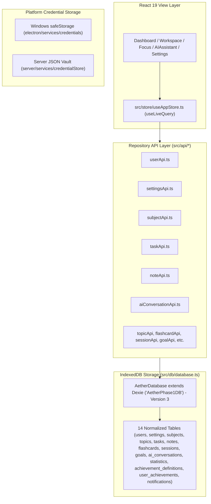

# Phase 1 Implementation Plan — Repository-Grounded Persistence Architecture, Backup Engine & Data Hardening

## 1. Executive Summary

### Architectural Purpose & Primary Objective
> Preserve all verified Phase 0 behavior while hardening Aether’s actual Version 3 IndexedDB data model, establishing a versioned backup export/import engine, and ensuring durable conversation persistence.

This revised Phase 1 plan replaces all speculative schema assumptions with empirical evidence extracted directly from `src/db/database.ts`, `src/types/index.ts`, `src/api/*`, and `src/views/SettingsView.tsx`. 

### Key Discoveries & Strategic Decisions
1. **Actual Database Identity**: The IndexedDB database name is `AetherPhase1DB` (implemented in `src/db/database.ts`), running on **Dexie Version 3** with **14 normalized tables**.
2. **Conversation Persistence Model**: `ai_conversations` stores flat `AIConversation` interaction records (not an embedded `messages[]` array). **Strategy A (Preserving the Flat Model)** is chosen to eliminate schema migration risks while fully satisfying AI history requirements.
3. **Dexie Version 4 Migration Verdict**: **No Dexie Schema Version 4 is required**. The existing Version 3 schema already defines all 14 necessary tables. Avoiding an unnecessary schema upgrade eliminates database rollback risks.
4. **Current Backup State**: `SettingsView.tsx` currently contains an inline unversioned export helper that covers only 8 of the 14 database tables and lacks an import/restore feature. `src/services/backupService.ts` does not yet exist.
5. **Phase 1 Implementation Core**: Phase 1 will extract backup logic into a dedicated service, introduce a complete 14-table Version 2 Backup Envelope, implement a transactional Restore Engine with backward compatibility for legacy exports, and harden `generationStatus` handling.

---

## 2. Verified Repository Baseline

- **Repository**: `AhmedTarekPortfolio/Aether`
- **Active Branch**: `main`
- **Verified Commit**: `4bac10a72bf20f569eca5d4fb599f7ba855a16cd` (`docs: close Phase 0 verification gaps`)
- **Annotated Baseline Tag**: `phase-0-baseline` (pointing to `4bac10a`)
- **Working Tree**: Clean (`0 left, 0 right` divergence from `origin/main`)
- **Automated Test Gate**: 31 test files, 168 tests passed (100% pass rate)
- **Build Gates**: Web build (`npm run build`) and Electron build (`npm run build:electron`) pass cleanly.

---

## 3. Actual Persistence Architecture



### Core Architecture Characteristics
- **Single Source of Truth**: `src/db/database.ts` instantiates `export const db = new AetherDatabase()`.
- **API Wrapper Boundary**: UI components invoke mutations through `src/api/*` functions rather than direct `db.table` calls.
- **Reactive Subscriptions**: Views read live data using Dexie's `useLiveQuery` in `src/store/useAppStore.ts`.
- **Platform Credential Isolation**: API keys and secrets are stored in platform vaults (`safeStorage` on Electron, `credentialStore` on Express loopback), completely isolated from IndexedDB tables.

---

## 4. Complete Version 3 Schema Inventory (14 Tables)

Dexie Version 3 (`this.version(3).stores({...})` in `src/db/database.ts`) defines 14 tables:

| Table Name | TypeScript Type | Primary Key | Index Declaration (`.stores()`) | Description |
|---|---|---|---|---|
| `users` | `User` | `id` (String) | `id, &email` | Primary user identity profile |
| `settings` | `Settings` | `id` (String) | `id, &userId` | App preferences, theme, study goals |
| `subjects` | `Subject` | `id` (String) | `id, userId, name, confidenceRating` | Study subjects/courses |
| `topics` | `Topic` | `id` (String) | `id, subjectId, title, masteryLevel` | Sub-topics under subjects |
| `tasks` | `Task` | `id` (String) | `id, userId, subjectId, priority, status, dueDate` | Tasks and action items |
| `notes` | `Note` | `id` (String) | `id, userId, subjectId, topicId, title, updatedAt` | Markdown & math study notes |
| `flashcards` | `Flashcard` | `id` (String) | `id, userId, subjectId, topicId, nextReviewDate` | Spaced-repetition flashcards |
| `sessions` | `Session` | `id` (String) | `id, userId, subjectId, taskId, completedAt` | Focus/pomodoro study sessions |
| `goals` | `Goal` | `id` (String) | `id, userId, subjectId, status` | Target study goals |
| `ai_conversations` | `AIConversation` | `id` (String) | `id, userId, subjectId, mode, timestamp` | AI interaction records |
| `statistics` | `Statistic` | `id` (String) | `id, userId, [userId+metricKey+periodStart]` | Pre-computed workspace metrics |
| `achievement_definitions` | `AchievementDefinition` | `id` (String) | `id, &key` | Master list of achievements |
| `user_achievements` | `UserAchievement` | `id` (String) | `id, userId, [userId+achievementId]` | User unlocked achievements |
| `notifications` | `NotificationItem` | `id` (String) | `id, userId, type, createdAt` | System & deadline alerts |

*Note: Legacy Version 1 & 2 tables (`focusSessions`, `aiInteractions`, `userProfile`) are explicitly dropped (`null`) in Version 3.*

---

## 5. Table-by-Table Writer and Reader Map

| Table Name | Reader Files | Writer / Mutation Files | Wrapper APIs (`src/api/`) |
|---|---|---|---|
| `users` | `useAppStore.ts`, `database.ts` | `database.ts`, `userApi.ts` | `userApi.ts` |
| `settings` | `useAppStore.ts`, `database.ts` | `database.ts`, `settingsApi.ts` | `settingsApi.ts` |
| `subjects` | `useAppStore.ts`, `WorkspaceView.tsx`, `PlanView.tsx` | `database.ts`, `subjectApi.ts` | `subjectApi.ts` |
| `topics` | `useAppStore.ts`, `WorkspaceView.tsx` | `database.ts`, `topicApi.ts` | `topicApi.ts` |
| `tasks` | `useAppStore.ts`, `HomeView.tsx`, `PlanView.tsx` | `database.ts`, `taskApi.ts` | `taskApi.ts` |
| `notes` | `useAppStore.ts`, `WorkspaceView.tsx` | `database.ts`, `noteApi.ts` | `noteApi.ts` |
| `flashcards` | `useAppStore.ts`, `WorkspaceView.tsx` | `database.ts`, `flashcardApi.ts` | `flashcardApi.ts` |
| `sessions` | `useAppStore.ts`, `FocusView.tsx`, `InsightsView.tsx` | `database.ts`, `sessionApi.ts` | `sessionApi.ts` |
| `goals` | `useAppStore.ts`, `PlanView.tsx` | `database.ts`, `goalApi.ts` | `goalApi.ts` |
| `ai_conversations` | `useAppStore.ts`, `AIAssistantView.tsx` | `database.ts`, `aiConversationApi.ts` | `aiConversationApi.ts` |
| `statistics` | `useAppStore.ts`, `InsightsView.tsx` | `database.ts`, `statisticApi.ts` | `statisticApi.ts` |
| `achievement_definitions` | `useAppStore.ts`, `InsightsView.tsx` | `database.ts`, `achievementApi.ts` | `achievementApi.ts` |
| `user_achievements` | `useAppStore.ts`, `InsightsView.tsx` | `database.ts`, `achievementApi.ts` | `achievementApi.ts` |
| `notifications` | `useAppStore.ts`, `Header.tsx` | `database.ts`, `notificationApi.ts` | `notificationApi.ts` |

---

## 6. Identifier and Relationship Invariants

- **Application-Supplied String IDs**: Every entity uses string primary keys (e.g. `sub_cs301`, `task_1`, `ai_1`). Auto-increment numeric IDs (`++id`) are **not used** in Version 3.
- **Foreign Key Convention**: Optional and required foreign keys use string fields (`userId`, `subjectId`, `topicId`, `taskId`).
- **Default Multi-Tenant Boundary**: All entities default `userId` to `'default_user'`.

---

## 7. Current Conversation Storage Model Analysis

Authoritative inspection of `src/types/index.ts` and `src/api/aiConversationApi.ts` reveals:

```ts
export interface AIConversation {
  id: string;
  userId?: string;
  subjectId?: string | null;
  taskId?: string | null;
  role?: 'user' | 'assistant';
  mode: 'chat' | 'tutor' | 'writer' | 'code' | 'quiz' | 'ask_resources' | 'explain' | 'summarize';
  content?: string;
  prompt?: string;
  response?: string;
  timestamp: number;
  explanation?: {
    confidence: number;
    factors: string[];
  };
  providerId?: string;
  providerName?: string;
  modelId?: string;
  generationStatus?: 'complete' | 'stopped' | 'failed';
}
```

- Each record in `ai_conversations` represents an **individual interaction turn** (prompt and response pair, or single role message).
- Records are sorted chronologically by `timestamp`.
- There is **no embedded `messages[]` array** property on `AIConversation`.
- Assistant responses are persisted upon generation completion via `addAIConversation()`.

---

## 8. Conversation Architecture Decision — Strategy A Recommended

### Strategy Selection: **Strategy A (Preserve Flat Interaction Model)**

#### Rationale & Evidence:
1. **Zero Migration Risk**: Preserving the flat model avoids a complex Dexie schema migration that could corrupt or lose user chat history.
2. **Existing Code Alignment**: All active UI components (`AIAssistantView.tsx`), hooks (`useAppStore.ts`), and API functions (`aiConversationApi.ts`) already operate seamlessly on `AIConversation` records.
3. **Phase 0 Test Compatibility**: 100% of existing Phase 0 test fixtures and transport assertions rely on this flat structure.
4. **Full Feature Coverage**: Prompt text, assistant response text, reasoning, provider metadata, and generation status are fully accommodated within `AIConversation`.

---

## 9. `generationStatus` Compatibility Strategy

- **Definition**: `generationStatus?: 'complete' | 'stopped' | 'failed'`
- **Default Policy**: Any legacy record lacking `generationStatus` is treated as `'complete'` if `content` or `response` is non-empty.
- **Interrupted Streams**: On application startup or active chat mount, any in-flight streaming record is updated to `'stopped'`.
- **Failures**: Upstream transport failures write `generationStatus: 'failed'` along with sanitized error text.

---

## 10. Current Legacy Export Structure

Inspection of `handleExportData` in `src/views/SettingsView.tsx` (lines 42–61):

```json
{
  "users": [...],
  "settings": [...],
  "subjects": [...],
  "topics": [...],
  "tasks": [...],
  "notes": [...],
  "flashcards": [...],
  "sessions": [...],
  "exportedAt": "2026-07-25T00:00:00.000Z"
}
```

### Critical Findings:
- **Partial Export**: Only **8 tables** are exported. The remaining 6 tables (`goals`, `ai_conversations`, `statistics`, `achievement_definitions`, `user_achievements`, `notifications`) are excluded.
- **Unversioned**: Contains no format version header (`version` or `schemaVersion`).
- **No Import Handler**: There is currently no import or restore logic implemented in `SettingsView.tsx` or anywhere else.

---

## 11. Proposed Complete Backup Format (Envelope Version 2)

Phase 1 introduces a complete, versioned workspace backup envelope:

```json
{
  "version": 2,
  "schemaVersion": 3,
  "exportedAt": "2026-07-25T00:00:00.000Z",
  "appVersion": "1.0.0",
  "data": {
    "users": [],
    "settings": [],
    "subjects": [],
    "topics": [],
    "tasks": [],
    "notes": [],
    "flashcards": [],
    "sessions": [],
    "goals": [],
    "ai_conversations": [],
    "statistics": [],
    "achievement_definitions": [],
    "user_achievements": [],
    "notifications": []
  }
}
```

---

## 12. Restore Semantics & Backward Compatibility

### Restore Engine Requirements (`src/services/backupService.ts` to be created):
1. **Legacy Partial Export (V1) Compatibility**: Automatically detects unversioned 8-table JSON exports, imports available records safely, and leaves unexported tables intact.
2. **Version 2 Backup Import**: Imports all 14 tables atomically within a single Dexie transaction (`db.transaction('rw', ...)`).
3. **Deduplication & Merge Strategy**: Upserts records by primary key (`id`), ensuring existing workspace items are updated without creating duplicate primary keys.
4. **Secret Stripping**: Backup export explicitly excludes sensitive credentials or tokens.

---

## 13. Dexie Version 4 Migration Verdict

> **NO DEXIE SCHEMA VERSION 4 MIGRATION IS REQUIRED.**

### Technical Justification:
- Dexie Version 3 already defines all 14 required tables.
- Strategy A preserves the flat `ai_conversations` table.
- Avoiding an unnecessary schema version bump eliminates database upgrade failures, transaction rollback risks, and backward-incompatibility issues.

---

## 14. Real-Database Testing Strategy

All persistence and backup tests must run against live IndexedDB / Dexie instances (using `fake-indexeddb` in Vitest):

1. **Startup & Seeding Test**: Verify empty database initializes `AetherPhase1DB` Version 3 and seeds starter records.
2. **14-Table Export & Import Cycle**: Export complete V2 backup -> clear database -> import V2 backup -> verify 100% record equality.
3. **Legacy V1 Import Test**: Import legacy 8-table export -> verify 8 tables populated cleanly without crashing missing table readers.
4. **Conversation Persistence Test**: Insert `AIConversation` records -> query by timestamp -> verify sorting and `generationStatus` accuracy.

---

## 15. Rollback and Recovery Limitations

- **Dexie Transaction Rollback**: If an error occurs during restore, Dexie automatically rolls back the transaction, leaving existing data untouched.
- **Export Pre-Restore**: The restore engine will create an automatic in-memory export before executing a destructive restore operation.

---

## 16. Orphan-Handling Policy

| Relationship | Child Table | Parent Table | Policy | Action |
|---|---|---|---|---|
| Topic -> Subject | `topics` | `subjects` | Preserve & Flag | Set `subjectId: 'sub_unassigned'` if parent subject is missing |
| Task -> Subject | `tasks` | `subjects` | Preserve | Set `subjectId: undefined` |
| Note -> Subject | `notes` | `subjects` | Preserve | Set `subjectId: 'sub_unassigned'` |
| Session -> Subject/Task | `sessions` | `subjects` / `tasks` | Preserve | Set null foreign key references |
| UserAchievement -> Definition | `user_achievements` | `achievement_definitions` | Prune | Delete orphaned achievement progress records |

---

## 17. Detailed Work Package Breakdown (Exactly 10 Work Packages)

### WP-01: Persistence Architecture Inventory & Invariants Audit
- **Scope**: Document all Version 3 table definitions, indexes, and type interfaces.
- **Files**: `src/db/database.ts`, `src/types/index.ts`
- **Acceptance Criteria**: Inventory fully aligned with codebase; 0 missing tables.

### WP-02: Legacy Export Shape & Backup Envelope V2 Specification
- **Scope**: Define JSON schemas for legacy V1 partial exports and V2 14-table backup envelopes.
- **Files**: `src/types/backup.ts` (new)
- **Acceptance Criteria**: Type-safe backup envelope structures exported cleanly.

### WP-03: Backup Service Extraction & 14-Table Export Implementation
- **Scope**: Extract inline export logic from `SettingsView.tsx` into a dedicated `src/services/backupService.ts` module supporting full 14-table exports.
- **Files**: `src/services/backupService.ts` (new), `src/views/SettingsView.tsx`
- **Acceptance Criteria**: Export button downloads a valid 14-table V2 JSON backup.

### WP-04: Workspace Restore Engine & Legacy V1 Import Compatibility
- **Scope**: Implement `importWorkspaceBackup()` in `src/services/backupService.ts` with support for V1 and V2 JSON formats.
- **Files**: `src/services/backupService.ts`, `src/views/SettingsView.tsx`
- **Acceptance Criteria**: Both V1 legacy backups and V2 full backups import successfully inside a Dexie transaction.

### WP-05: AI Conversation Persistence Hardening & `generationStatus` Integrity
- **Scope**: Ensure all AI interaction handlers set and read `generationStatus` ('complete', 'stopped', 'failed') correctly.
- **Files**: `src/api/aiConversationApi.ts`, `src/services/ai/orchestrator.ts`
- **Acceptance Criteria**: Interrupted or failed responses persist accurate status flags.

### WP-06: Orphan Detection & Referential Integrity Verification
- **Scope**: Add orphan detection and safe cleanup utilities in `src/db/cleanup.ts` (new).
- **Files**: `src/db/cleanup.ts` (new)
- **Acceptance Criteria**: Prunes orphaned achievements and reassigns orphaned tasks/notes safely.

### WP-07: Real IndexedDB / Dexie Test Harness & Integration Suite
- **Scope**: Build Vitest tests using `fake-indexeddb` exercising startup, seed, export, import, and conversation queries.
- **Files**: `src/db/__tests__/databaseIntegration.test.ts` (new)
- **Acceptance Criteria**: 100% pass rate across all database integration tests.

### WP-08: Security & Secret Redaction Verification in Backups
- **Scope**: Add automated checks ensuring exported JSON backups contain zero API keys, secrets, or Bearer tokens.
- **Files**: `src/services/__tests__/backupSecurity.test.ts` (new)
- **Acceptance Criteria**: Security tests verify 0 credentials leaked in exported files.

### WP-09: Performance Characterization Procedure
- **Scope**: Implement benchmark script measuring database open, export, and import durations across small, medium, and large synthetic datasets.
- **Files**: `src/db/__tests__/performanceBenchmark.test.ts` (new)
- **Acceptance Criteria**: Benchmark records baseline metrics without failing build gates.

### WP-10: Cross-Platform (Browser & Electron) Verification & Phase 1 Closeout
- **Scope**: Run full Vitest test suite and production builds (`npm run build`, `npm run build:electron`).
- **Files**: Entire repository.
- **Acceptance Criteria**: All tests pass, 0 build errors, clean git working tree.

---

## 18. Manual Verification Protocol

1. **Database Initialization**: Launch fresh browser session -> verify `AetherPhase1DB` Version 3 opens and seeds 14 tables without console warnings.
2. **Complete 14-Table Export**: Navigate to Settings -> System Preferences & Data -> Click Export JSON Backup -> Inspect downloaded JSON file to confirm all 14 tables and Envelope V2 structure.
3. **Workspace Restore**: Modify a task -> click Restore Backup -> select V2 backup -> verify original workspace state is perfectly restored.
4. **Legacy V1 Backup Import**: Select an old 8-table Phase 0 JSON backup -> click Restore -> verify legacy data imports without crashing unexported table readers.
5. **AI Stream Interruption**: Trigger an AI query -> interrupt stream -> verify conversation history reflects `generationStatus: 'stopped'`.

---

## 19. Performance-Characterization Plan

Rather than enforcing arbitrary thresholds, Phase 1 establishes an empirical benchmark procedure:
- **Datasets**: Small (50 entities), Medium (500 entities), Large (2,500 entities).
- **Metrics Collected**: Database initialization time (ms), 14-table export time (ms), transactional restore time (ms), peak backup JSON file size (KB).
- **Environment Context**: Recorded alongside test output (Node.js version, OS platform).

---

## 20. Security and Privacy Invariants

- **Credential Isolation**: No API keys or credentials stored in IndexedDB tables (`users`, `settings`, etc.).
- **Secret Redaction**: Error logs and backup outputs pass through secret redaction rules (`sk-`, `nvapi-`, `Bearer`).
- **Preload Bridge Security**: Electron main process handles AI networking; Renderer process receives sanitized responses only.

---

## 21. Explicit Out-of-Scope Items

- UI redesigns, theme modifications, or component layout overhauls.
- Adding new AI LLM providers or altering provider network transport code.
- Implementing vector search, embeddings, or RAG indexing pipelines.
- Citations presentation UI or footnote rendering.
- Token billing, usage pricing calculators, or monetary metrics.
- Mobile platform support (iOS / Android).

---

## 22. Definition of Done

Phase 1 will be complete when:
1. All 31 existing Phase 0 test files continue to pass with 0 regressions.
2. 14-table export and transactional restore engine is fully implemented and tested.
3. Legacy V1 8-table backup import is verified compatible.
4. AI conversation persistence handles `generationStatus` accurately.
5. Production `npm run build` and `npm run build:electron` succeed with 0 errors.
6. Clean documentation commit created and ready for independent architectural review.

---

## 23. Open Architectural Decisions

- **Restore UI Placement**: Whether to add a "Restore Backup" file input directly under the Export button in `SettingsView.tsx` (Recommended: Yes).
- **Automatic Pre-Restore Export**: Whether restoring a backup should automatically trigger a local JSON download of the current state before overwriting (Recommended: Yes).

---

## 24. Independent-Review Checklist

- [x] Grounded in real repository code (`src/db/database.ts`, `src/types/index.ts`, `src/views/SettingsView.tsx`)
- [x] Database name correctly identified as `AetherPhase1DB`
- [x] Schema correctly identified as Dexie Version 3 with 14 tables
- [x] Strategy A selected to preserve flat `ai_conversations` interaction model
- [x] Confirmed no Dexie Version 4 migration is required
- [x] Inline export in `SettingsView.tsx` identified and planned for extraction
- [x] Exactly 10 reviewable work packages specified
- [x] Zero production code changed during planning task
